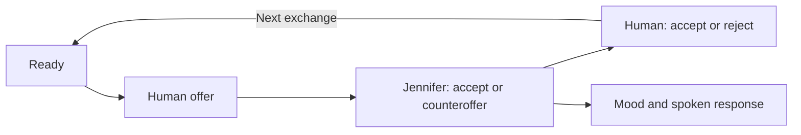

# Let's Negotiate with Jennifer! Towards a Speech-Based Human-Robot Negotiation — [ACAN 2018 · book chapter 2021]

Reyhan Aydoğan · Mehmet Onur Keskin · Umut Çakan

[Paper](https://doi.org/10.1007/978-981-15-5869-6_1) · [Explore the method](METHOD.md) · [Try the code](#try-it-yourself) · [Study guide](docs/protocol.md) · [Citation](#cite-the-paper)

[](https://github.com/monurkeskin/Lets-Negotiate-with-Jennifer-ACAN-2018/actions/workflows/tests.yml)

Jennifer turns resource sharing into a spoken, turn-taking interaction. A readiness notification makes the conversational order explicit; the robot chooses offers using a stochastic time-based tactic and expresses its response through predefined moods and arguments.

## Method

The human signals readiness and proposes a division of resources. Jennifer accepts or counteroffers. As the deadline approaches, two concession curves define the range from which the next offer is drawn. The human then accepts or rejects the response before the next exchange.



## Study and findings

The paper introduces this speech-based protocol and evaluates Jennifer in a human–robot resource-allocation task. It provides the foundation for the later study of [tactics and gestures](https://github.com/monurkeskin/Jennifer-Why-Not-THMS-2022). **Publication context:** ACAN 2018 workshop proceedings, published as a book chapter in 2021. [Read the paper](https://doi.org/10.1007/978-981-15-5869-6_1).

## What you can explore

Follow the readiness/offer/response sequence and inspect the published eight-resource point table. The package includes the 10-minute main-session outline and a separate illustrative practice task.

| Explore | Start with | What it shows |
| --- | --- | --- |
| Interaction protocol | [docs/protocol.md](docs/protocol.md) | Follow readiness, offer, response and rejection as distinct events. |
| Resource sharing | [configs/protocol-template.json](configs/protocol-template.json) | Inspect the eight-resource points from the paper. |
| Tactic | [reproduction/method.json](reproduction/method.json) | Explore the time-based concession component. |

The configurations, method checks and study guides are specific to this paper. The shared [NEGOTIATOR framework](https://github.com/monurkeskin/NEGOTIATOR-IJCAI-2024) runs the negotiation,
participant/conductor views and session analysis. Its exact **2.0.0** revision is
pinned in [framework.json](framework.json); installation brings it in automatically.

The published point profile and interaction stages are represented directly. The current text interface and generated proposal wording are maintained alternatives to the historical speech/argument pipeline; exact warning thresholds and the original performance assets are documented separately in [METHOD.md](METHOD.md).

## Try it yourself

Use Python 3.11 or 3.12 and Git. This first example runs locally without a robot,
camera or service account.

```bash
git clone https://github.com/monurkeskin/Lets-Negotiate-with-Jennifer-ACAN-2018.git
cd Lets-Negotiate-with-Jennifer-ACAN-2018
python3 -m venv .venv
source .venv/bin/activate
python -m pip install -r requirements.txt
python run.py --output demo-output
```

On Windows, create the environment with `py -3 -m venv .venv` and activate it with
`.venv\Scripts\Activate.ps1` in PowerShell.

Open **`demo-output/report/index.html`** to follow the example negotiation. The
output includes offers, utility trajectories, session records and exportable
figures. These are synthetic examples for exploring the software and method.
[Installation help](docs/compatibility.md).

### Read a calculation or open the study workspace

```bash
negotiator reproduce reproduction/method.json --output method-output
negotiator gui
```

In **New study → Import a paper or study configuration**, select
`configs/synthetic.json` for the demonstration, or `configs/protocol-template.json`
to inspect the paper's protocol template. The [study guide](docs/protocol.md)
explains the remaining protocol/asset requirements and device setup.

## Data and analysis

Participant records and recordings are not included. The examples use labeled
synthetic inputs so you can run the code and inspect its calculations. Recomputing
the human-study results requires authorized access to the original inputs and
the matching analysis procedure.

[Reproducibility guide](REPRODUCIBILITY.md) · [Paper-to-code map](paper-map.json) ·
[Analysis guide](docs/analysis.md)

## Build on the work

To change a paper condition, start with its configuration and add a small test
showing the intended behavior. Shared negotiation rules belong in NEGOTIATOR;
paper-specific profiles, protocols and result recipes belong here. The
[development guide](docs/development.md) walks through these boundaries and the
test-first workflow. [Contribution guide](CONTRIBUTING.md).

## Cite the paper

If you use this method or study design, please cite the associated paper:

```bibtex
@inproceedings{jennifernegotiation2021,
  title = {Let's Negotiate with Jennifer! Towards a Speech-Based Human-Robot Negotiation},
  author = {Aydoğan, Reyhan and Keskin, Mehmet Onur and Çakan, Umut},
  year = {2021},
  doi = {10.1007/978-981-15-5869-6_1},
  url = {https://doi.org/10.1007/978-981-15-5869-6_1}
}
```

The [citation file](CITATION.cff) provides the paper as the preferred citation.
For software provenance, also record the version and [archived 2.0.0 artifact](https://doi.org/10.5281/zenodo.22729002).
When using the shared engine in new research, cite the
[NEGOTIATOR framework paper](https://doi.org/10.24963/ijcai.2024/1012).
GPL-3.0-only; original contributors and sources are credited in [NOTICE](NOTICE).
