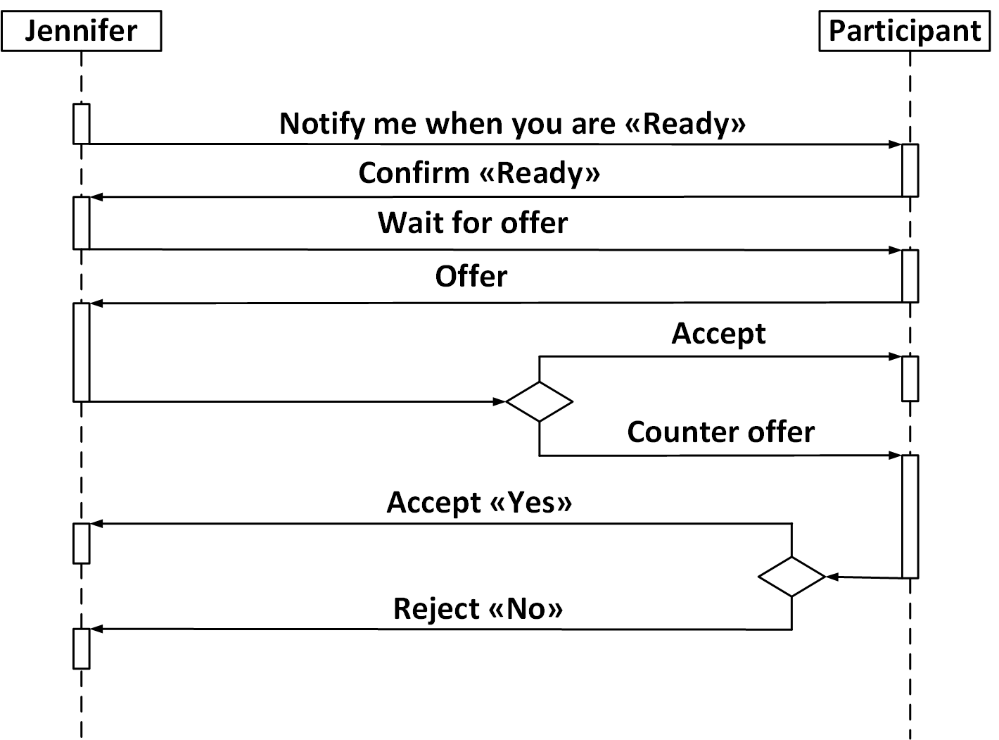
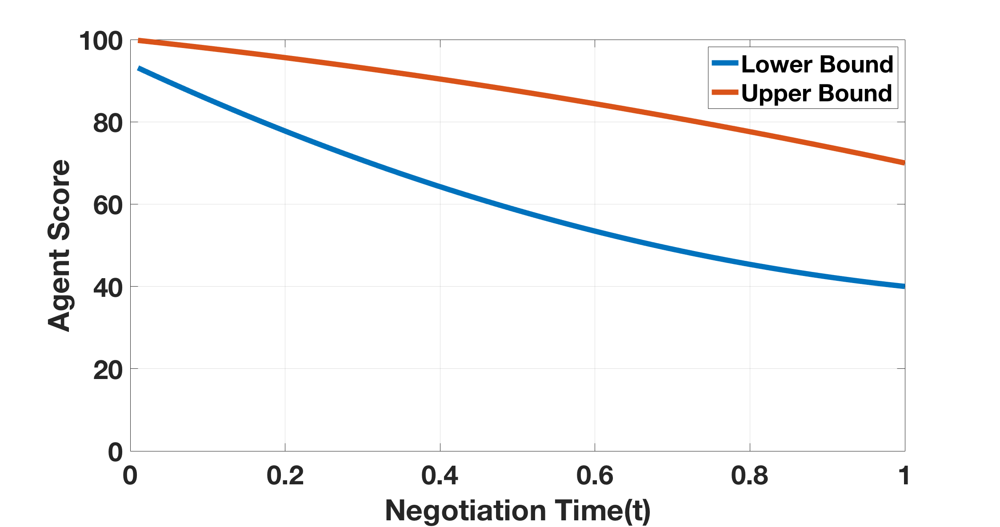
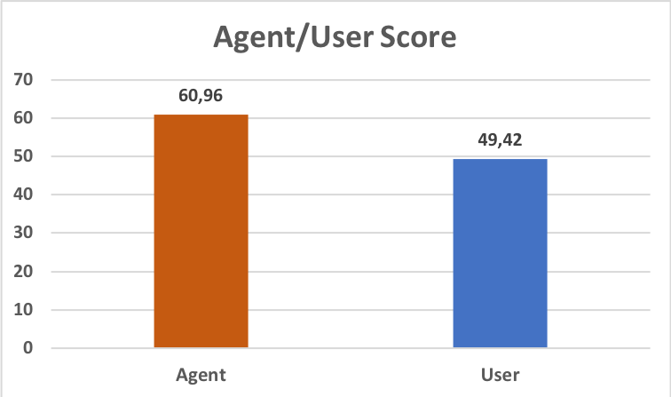

# Let's Negotiate with Jennifer! Towards a Speech-Based Human-Robot Negotiation — [ACAN 2018 · book chapter 2021]

Reyhan Aydoğan · Mehmet Onur Keskin · Umut Çakan

[Paper](https://doi.org/10.1007/978-981-15-5869-6_1) · [Explore the method](METHOD.md) · [Try the code](#try-it-yourself) · [Study guide](docs/protocol.md) · [Citation](#cite-the-paper)

[](https://github.com/monurkeskin/Lets-Negotiate-with-Jennifer-ACAN-2018/actions/workflows/tests.yml)

Imagine dividing the supplies left on a deserted island with a robot. You want
the food and medicine; Jennifer has her own priorities. **This paper turns that
bargaining task into a spoken interaction**, with a clear way to signal readiness,
make an offer and respond to a counteroffer.

## A conversation with an explicit protocol



*Figure 1 from the paper. The readiness exchange separates thinking aloud from
making an offer. Both parties describe the resources the **human receives**.*

Jennifer's time-dependent stochastic bidding tactic (TSBT) chooses an offer
between two concession bounds. As the deadline approaches, both bounds fall.
The robot also responds through predefined moods and arguments, connecting its
formal decision to a phrase the person can understand.



*Figure 2. The interval between the curves determines the range for Jennifer's
next offer. The protocol and the bidding tactic have separate responsibilities.*

## What the study found

Thirty people negotiated with Jennifer after a practice session. The main task
used eight indivisible resources and a ten-minute deadline; each party knew only
its own point profile. Twenty-six negotiations reached agreement.



*Figure 5 and Section 3.2, published study. Means are over the 26 agreements.*

| Reported measure | Value |
| --- | ---: |
| Negotiations reaching agreement | 26 / 30 (86.7%) |
| Jennifer's mean score in agreements | 60.96 / 100 |
| Human mean score in agreements | 49.42 / 100 |
| Agreements with a higher score for Jennifer | 15 / 26 |

The paper reports higher scores for Jennifer on average in this task. It is the
starting point for the later [tactic and gesture study](https://github.com/monurkeskin/Jennifer-Why-Not-THMS-2022),
which asks how the bidding rule and body language interact.
This chapter was presented at **ACAN 2018** and published in the 2021 proceedings
volume. [Figure and result sources](docs/paper/README.md).

## What you can explore

Follow the readiness/offer/response sequence and inspect the published eight-resource point table. The package includes the 10-minute main-session outline and a separate illustrative practice task.

| Explore | Start with | What it shows |
| --- | --- | --- |
| Interaction protocol | [docs/protocol.md](docs/protocol.md) | Follow readiness, offer, response and rejection as distinct events. |
| Resource sharing | [configs/protocol-template.json](configs/protocol-template.json) | Inspect the eight-resource points from the paper. |
| Tactic | [reproduction/method.json](reproduction/method.json) | Explore the time-based concession component. |

The configurations, method checks and study guides are specific to this paper. The shared [NEGOTIATOR framework](https://github.com/monurkeskin/NEGOTIATOR-IJCAI-2024) runs the negotiation,
participant/conductor views and session analysis. Its exact **2.0.0** revision is
pinned in [framework.json](framework.json); installation brings it in automatically.

The published point profile and interaction stages are represented directly. The current text interface and generated proposal wording are maintained alternatives to the historical speech/argument pipeline; exact warning thresholds and the original performance assets are documented separately in [METHOD.md](METHOD.md).

## Try it yourself

Use Python 3.11 or 3.12 and Git. This first example runs locally without a robot,
camera or service account.

```bash
git clone https://github.com/monurkeskin/Lets-Negotiate-with-Jennifer-ACAN-2018.git
cd Lets-Negotiate-with-Jennifer-ACAN-2018
python3 -m venv .venv
source .venv/bin/activate
python -m pip install -r requirements.txt
python run.py --output demo-output
```

On Windows, create the environment with `py -3 -m venv .venv` and activate it with
`.venv\Scripts\Activate.ps1` in PowerShell.

Open **`demo-output/report/index.html`** to follow the example negotiation. The
output includes offers, utility trajectories, session records and exportable
figures. These are synthetic examples for exploring the software and method.
[Installation help](docs/compatibility.md).

### Read a calculation or open the study workspace

```bash
negotiator reproduce reproduction/method.json --output method-output
negotiator gui
```

In **New study → Import a paper or study configuration**, select
`configs/synthetic.json` for the demonstration, or `configs/protocol-template.json`
to inspect the paper's protocol template. The [study guide](docs/protocol.md)
explains the remaining protocol/asset requirements and device setup.

## Data and analysis

Participant records and recordings are not included. The examples use labeled
synthetic inputs so you can run the code and inspect its calculations. Recomputing
the human-study results requires authorized access to the original inputs and
the matching analysis procedure.

[Reproducibility guide](REPRODUCIBILITY.md) · [Paper-to-code map](paper-map.json) ·
[Analysis guide](docs/analysis.md)

## Build on the work

To change a paper condition, start with its configuration and add a small test
showing the intended behavior. Shared negotiation rules belong in NEGOTIATOR;
paper-specific profiles, protocols and result recipes belong here. The
[development guide](docs/development.md) walks through these boundaries and the
test-first workflow. [Contribution guide](CONTRIBUTING.md).

## Cite the paper

If you use this method or study design, please cite the associated paper:

```bibtex
@inproceedings{jennifernegotiation2021,
  title = {Let's Negotiate with Jennifer! Towards a Speech-Based Human-Robot Negotiation},
  author = {Aydoğan, Reyhan and Keskin, Mehmet Onur and Çakan, Umut},
  year = {2021},
  doi = {10.1007/978-981-15-5869-6_1},
  url = {https://doi.org/10.1007/978-981-15-5869-6_1}
}
```

The [citation file](CITATION.cff) provides the paper as the preferred citation.
For software provenance, also record the version and [archived 2.0.0 artifact](https://doi.org/10.5281/zenodo.22729002).
When using the shared engine in new research, cite the
[NEGOTIATOR framework paper](https://doi.org/10.24963/ijcai.2024/1012).
GPL-3.0-only; original contributors and sources are credited in [NOTICE](NOTICE).
